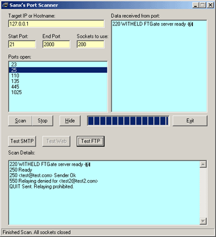



## Sanx's Port Scanner

### Description

Scans a range of TCP/IP ports on any given address and attempts to retrieve the header info from that port (if sent). Sends syntactically correct queries to port 80, and also tests FTP ports for anonymous uploads and SMTP ports for open relay functionality.
 
### More Info
 
Almost no commenting, but code is pretty self-explanatory.

             |
---                |---
**Submitted On**   |2001-08-21 16:38:10
**By**             |[Sanx](https://github.com/Planet-Source-Code/PSCIndex/blob/master/ByAuthor/sanx.md)
**Level**          |Intermediate
**User Rating**    |5.0 (15 globes from 3 users)
**Compatibility**  |VB 6\.0
**Category**       |[Complete Applications](https://github.com/Planet-Source-Code/PSCIndex/blob/master/ByCategory/complete-applications__1-27.md)
**World**          |[Visual Basic](https://github.com/Planet-Source-Code/PSCIndex/blob/master/ByWorld/visual-basic.md)
**Archive File**   |[Sanx's Por250458212001\.zip](https://github.com/Planet-Source-Code/sanx-sanx-s-port-scanner__1-26442/archive/master.zip)

